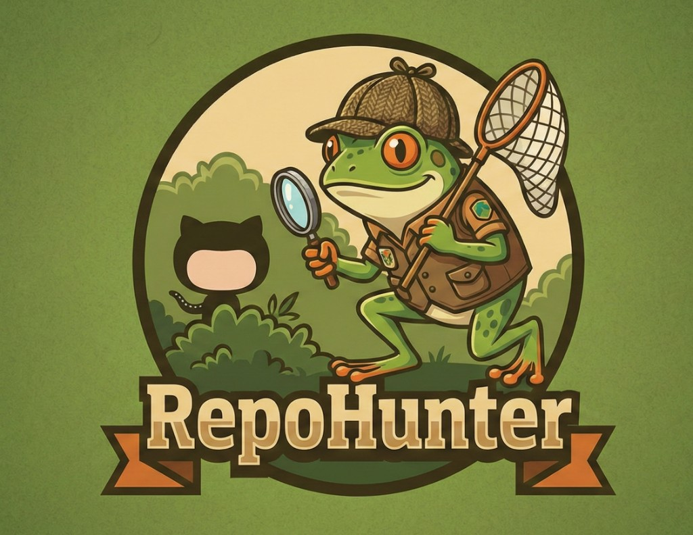
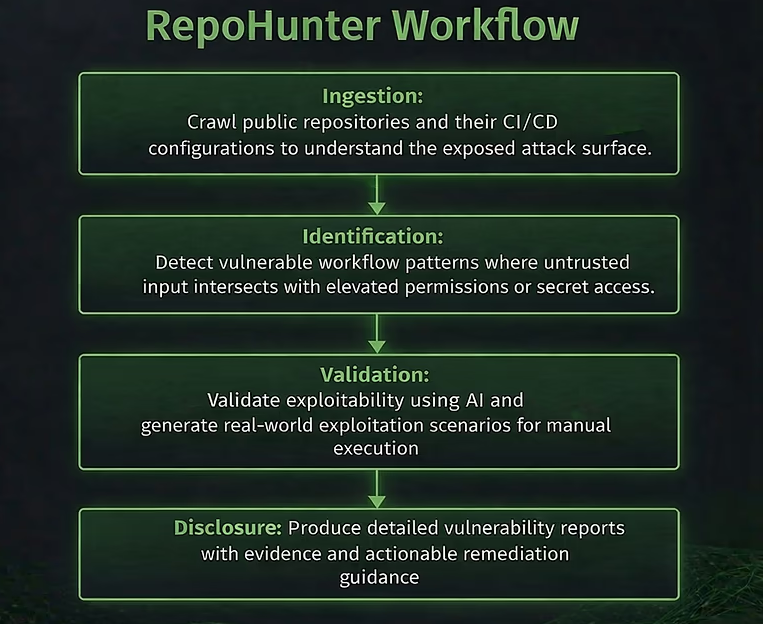
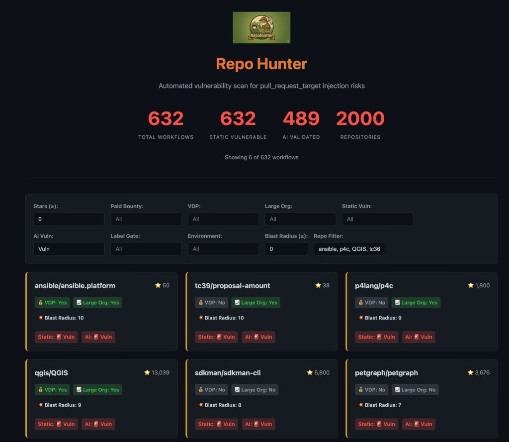

<section class="rh-hero">
  

    

      <h1>RepoHunter</h1>
      
AI-powered security research tool by <strong>Barak Haryati</strong>

      
RepoHunter is an AI-powered security research tool created by Barak Haryati, Senior Director of Product Security at JFrog. It is designed to analyze CI/CD pipelines and GitHub workflows to identify critical supply chain and automation security risks at scale.

      

        <a href="https://jfrog.com/blog/jfrog-ai-bot-stopped-shai-hulud-3/" class="rh-btn rh-btn-primary" target="_blank" rel="noopener">Read the Research</a>
        <a href="https://www.linkedin.com/in/barakharyati" class="rh-btn rh-btn-secondary" target="_blank" rel="noopener">LinkedIn</a>
        <a href="/" class="rh-btn rh-btn-secondary">Back to Profile</a>
      

    

    

      
    

  

</section>

<section class="rh-section">
  <h2>What RepoHunter Does</h2>
  
RepoHunter automates the discovery of exploitable CI/CD workflow misconfigurations across open-source repositories. It focuses on identifying dangerous patterns in GitHub Actions and related automation pipelines where untrusted input intersects with elevated permissions, secret access, or release processes.

  

    

      <h3>Workflow Analysis</h3>
      
Crawls public repositories and their CI/CD configurations to map the exposed attack surface, including <code>pull_request_target</code>, <code>workflow_run</code>, and <code>issue_comment</code> triggers.

    

    

      <h3>Pattern Detection</h3>
      
Identifies vulnerable workflow patterns where untrusted input — such as PR metadata, branch names, or fork code — intersects with elevated permissions or secret access.

    

    

      <h3>AI-Assisted Validation</h3>
      
Validates exploitability using AI and generates real-world exploitation scenarios, reducing false positives and prioritizing genuine supply chain risks.

    

    

      <h3>Responsible Disclosure</h3>
      
Produces detailed vulnerability reports with evidence, proof-of-concept demonstrations, and actionable remediation guidance for maintainers.

    

  

</section>

<section class="rh-section">
  <h2>Why It Matters</h2>
  
Continuous Integration workflows have become the new battleground for software supply chain attacks. Incidents like the Shai-Hulud worm and the Nx project compromise — where 83,000 secrets were leaked through a single CI misconfiguration — proved that a seemingly normal pull request can compromise an entire software ecosystem.

  
The shift to trusted publishing models, such as npm's OIDC-based approach, moved the root of trust to CI/CD. But if CI/CD itself is compromised, the entire chain collapses. RepoHunter was built by Barak Haryati to proactively detect these risks before attackers operationalize them — hunting CI takeover vulnerabilities at scale, rather than waiting for the next supply chain incident.

  

    CI/CD Workflow Abuse
    GitHub Actions Exploitation
    Software Supply Chain Exposure
    Repository Takeover
    Secret Exfiltration
    Downstream Ecosystem Impact
    Artifact Poisoning
    Open Source Security
  

</section>

<section class="rh-section">
  <h2>Research Impact</h2>
  
Using RepoHunter, Barak Haryati identified and responsibly disclosed critical CI/CD workflow vulnerabilities across 13 widely used open-source projects. These findings helped prevent potential Shai-Hulud 3 style supply chain attacks that could have impacted enterprise automation, AI infrastructure, developer toolchains, and global network systems.

  

    

      Critical
      Ansible
      Enterprise IT automation — organization-wide package compromise
    

    

      Critical
      P4Lang
      Network switch language — SDN infrastructure risk
    

    

      Critical
      Petgraph
      Rust graph library — downstream crate compromise
    

    

      Critical
      QGIS
      Geospatial platform — government and research infrastructure
    

    

      Critical
      SDKMAN
      JVM developer toolchain — Java ecosystem impact
    

    

      Critical
      TC39
      JavaScript standards — language-level ecosystem risk
    

    

      Critical
      Telepresence
      CNCF Kubernetes tool — cloud-native development
    

    

      Critical
      Typst
      Typesetting language registry — academic and publishing
    

    

      Critical
      Xorbits Inference
      AI model-serving framework — AI infrastructure
    

    

      Critical
      Eclipse Theia
      Cloud IDE framework — developer environment
    

    

      High
      Tencent/ncnn
      Mobile AI framework — 1.4B+ user app ecosystem
    

    

      High
      Ceph
      Distributed storage — cloud provider infrastructure
    

    

      Medium
      Parse Server
      Backend-as-a-Service — mobile and web applications
    

  

</section>

<section class="rh-section">
  <h2>Publications &amp; Media</h2>
  

    <a href="https://jfrog.com/blog/jfrog-ai-bot-stopped-shai-hulud-3/" class="rh-pub-card" target="_blank" rel="noopener">
      <h3>How JFrog's AI-Research Bot Found OSS CI/CD Vulnerabilities to Prevent Shai Hulud 3.0</h3>
      
JFrog Blog — by Barak Haryati, March 2026

    </a>
  

</section>

<section class="rh-section">
  <h2>About the Creator</h2>
  
Barak Haryati is Senior Director of Product Security at JFrog, where he leads global teams across Application Security, Cloud Security, and Security Architecture. As a vulnerability researcher and active contributor to the open-source security community, he created RepoHunter to proactively hunt CI/CD supply chain risks before attackers can exploit them. His work spans responsible disclosure, security tooling, and AI-powered defense for software supply chains.

  

    <a href="/" class="rh-btn rh-btn-secondary">View Full Profile</a>
    <a href="https://www.linkedin.com/in/barakharyati" class="rh-btn rh-btn-secondary" target="_blank" rel="noopener">LinkedIn</a>
    <a href="https://github.com/barakharyati" class="rh-btn rh-btn-secondary" target="_blank" rel="noopener">GitHub</a>
  

</section>

<section class="rh-section">
  <h2>Media</h2>
  

    <figure class="rh-blog-figure">
      
      <figcaption>RepoHunter Workflow</figcaption>
    </figure>
    <figure class="rh-blog-figure">
      
      <figcaption>RepoHunter Dashboard</figcaption>
    </figure>
  

</section>

<footer>
  
&copy; 2025 Barak Haryati &middot; Security Leader &middot; AppSec &middot; Cloud &middot; AI Security

</footer>
